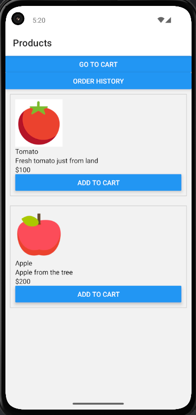
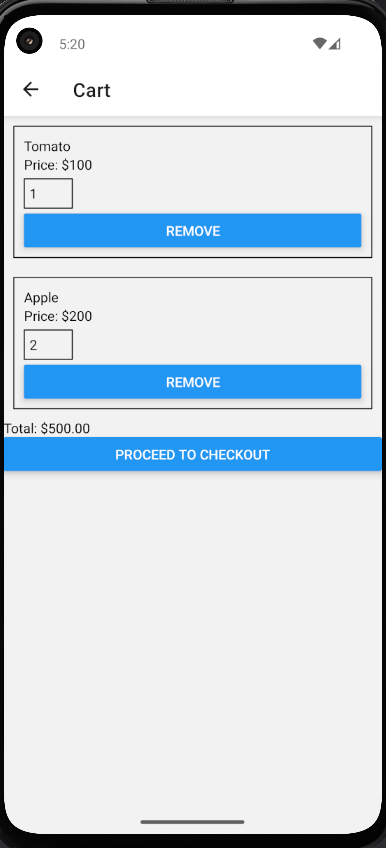
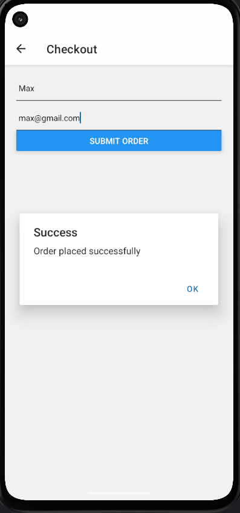
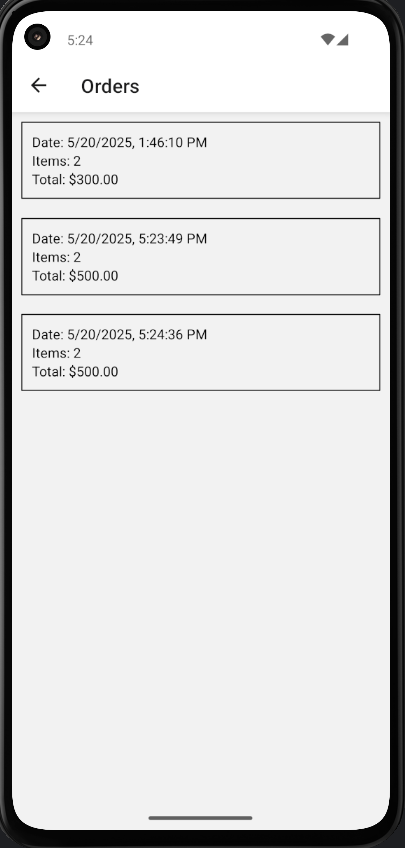

# MobileLab8RN2025

## 🚀 Getting Started

Follow these steps to set up and run the project.

### 📌 Prerequisites

Make sure you have the following installed before starting:

- [Node.js](https://nodejs.org/)
- [Expo CLI](https://docs.expo.dev/get-started/installation/)

### 📥 Clone the Repository

```sh  
git clone https://github.com/merelythesame/MobileLabsRN2025  
cd MobileLabsRN2025  
```

### 📦 Install Dependencies

Using npm:
```sh
npm install
```

### ▶️ Start the Expo Development Server

```sh
expo start
```

### Result

#### Products    Cart

 

#### Checkout     DB

  


